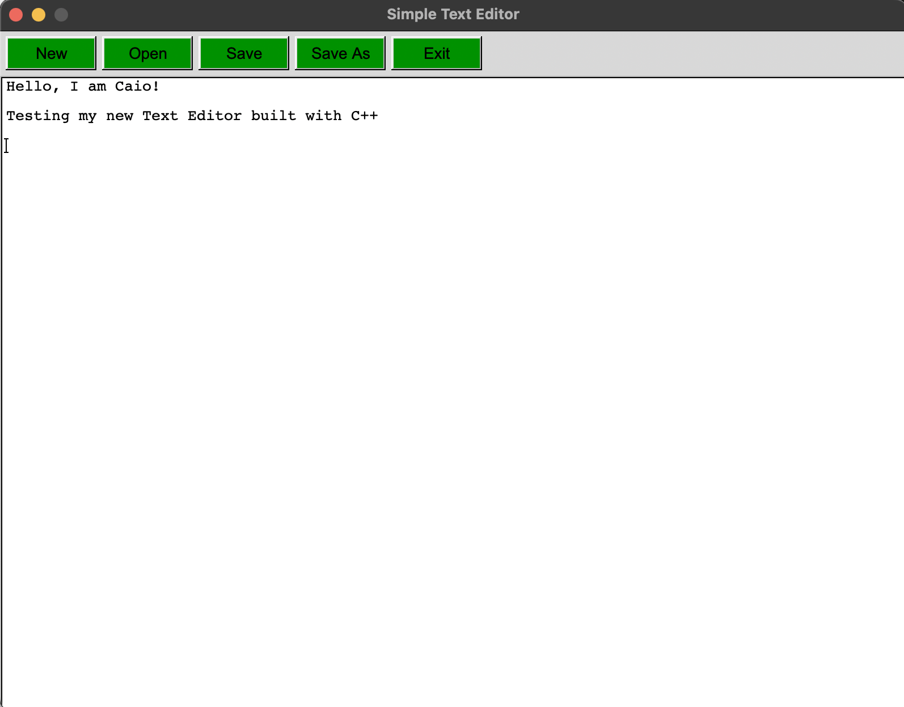

# MyOwnTextEditor

A simple text editor built with **C++** and **FLTK**, featuring basic file operations like *New*, *Open*, *Save*, and *Save As*. It also comes with custom styling for an enhanced user experience.

---

## Features

- **Basic File Operations**: Easily create, open, save, and save as files.
- **Custom Styling**: Dark green buttons at the top for a sleek interface.
- **Text Editing**: A simple, minimalist text editing window to quickly write notes or code.
- **Cross-platform**: Build for macOS and other platforms supported by FLTK.

---

## Application Preview

Below is a snapshot of the text editor in action:



Feel free to contribute, and suggest improvements!

---

### How to Build and Run

1. Clone the repository:
   ```
   git clone https://github.com/cmontilha/MyOwnTextEditor.git
   cd MyOwnTextEditor
   ```
2. Install FLTK if you don't have it:
   ```
   brew install fltk
   ```
3. Compile the code:
   ```
   fltk-config --compile editor.cxx
   ```
4. Run the text editor:
   ```
   ./editor
   ```
---

## Future Improvements

- Add more advanced text formatting features.
- Implement search and replace functionality.
- Support for multiple file formats.
- Improve file handling with better error handling.

---

## License

This project is licensed under the MIT License.


